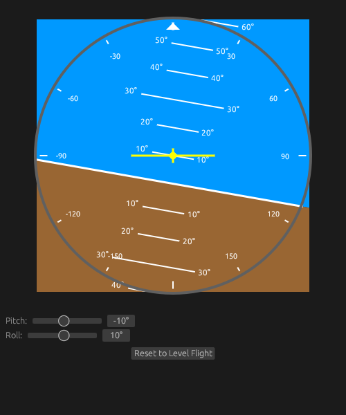

# Attitude Indicator

This is an implementation of a Attitude Indicator commonly seen on aircraft flight panels. The Attitude Indicator helps pilots maintain spatial orientation by displaying an artifical horizon with a pitch indication and roll indication of the aircraft.

Use the Pitch slider to adjust the aircraft's nose position up or down.
Use the Roll slider to adjust the aircraft's bank angle left or right.



To compile and run:
```
cargo run
```
